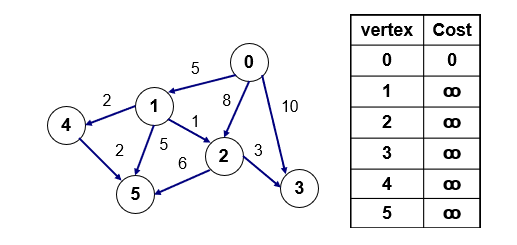
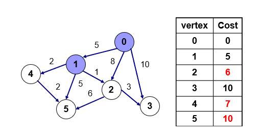
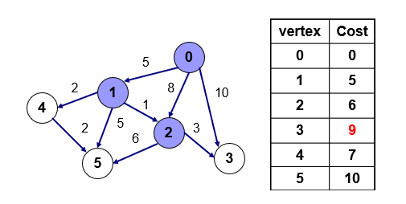
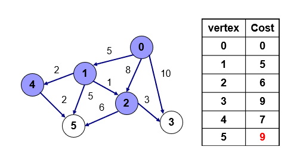
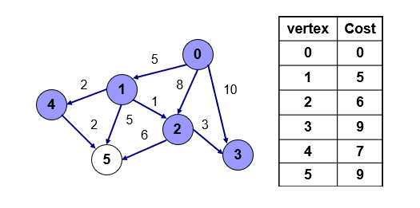
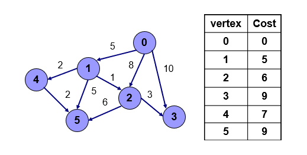

## 다익스트라(Dijkstra) 알고리즘
- 모든 정점까지의 최단 경로 구하기  
- 가중치가 음수가 아닐때만 사용할 수 있다.
- 방향이 있는 가중치 그래프

**간선** : 연결된 선  
**노드** : 각 지점

**힙은 최소 힙과 최대 힙이 있는데 여기서는 최소 힙을 가진 큐를 사용한다**


###  다익스트라 기본 원리
- 방문하지않은 점중 값이 가장 작은 점을 방문
- 그 점을 통해서 갈 수 있는 점 중에서 아직 방문하지 않은점의 값이 이전에 기록하 값보다 작으면 그 거리를 갱신

  

- cost : 그 점을 가기 위한 값을 기록하는 배열  
- 0번을 시작점으로 해서 0번에서 갈 수 있는 모든점에 대해 최단거리를 구하고 아직 각 점들에 대한 거리를 아무거도 모름으로 모두 무한대로 초기화

  
- 0번 점을 방문하고 0번점에서 갈 수 있는 1,2,3번 점에대해 기존에 cost 배열에 있는 값과 0에서 가는 값을 비교해서 작을 경우 갱신
- 1,2,3에 5,8,10으로 갱신  

  
- 방문하지 않은 점(1,2,3,4,5) 중에서 값이 가장 작은 점을 방문  
- 1번을 통해서 갈 수 있는 점(2,4,5)에 가는 거리에 0번에서 1번으로 가는 거리 5에 1에서 각 점으로 가는 거리 1,2,5를 더해서 2,4,5번 모두 1번을 통해 가는 거리가 더 짧음으로 2,4,5번점의 값을 갱신

  
- 방문하지 않은 점 중 2번의 값이 가장 작음으로 2번을 방문  
- 2번을 통해서 갈 수 있는 3,5번의 점을 이전의 값과 비교하면 5는 12, 3은 9이므로 3을 갱신  

  
- 4번을 통해서 5번으로 갈 경우 9이므로 기존에 있던 값 10보다 작으므로 갱신

  
- 3번점 방문, 하지만 갈 수 있는 점이 없으므로 다음점으로 이동

  
- 5번점 방문, 하지만 갈 수 있는 점이 없으므로 종료

```java
import java.io.IOException;
import java.util.ArrayList;
import java.util.Arrays;
import java.util.HashMap;
import java.util.PriorityQueue;


public class Dijkstra{
    public static class Edge implements Comparable<Edge>{
        public int distance;
        public String vertex;

        public Edge(int distance, String vertex){
            this.distance=distance;
            this.vertex=vertex;
        }

        //System.out.println()으로 객체 자체 출력
        public String toString(){
            return "vertex" + this.vertex+",distance: " + this.distance;
        }

        @Override
        public int compareTo(Edge edge){
            return this.distance-edge.distance;
        }
    }
    public HashMap<String, Integer> dijkstra(HashMap<String, ArrayList<Edge>> graph, String start) {//String : vertex, Integer : 가중치
        Edge edgeNode, adjacentNode;
        int currentDistance, weight, distance;
        String currentNode,adjacent;
        ArrayList<Edge> nodeList;
        HashMap<String, Integer>distances = new HashMap<String, Integer>();//배열을 만듦
        for(String key :  graph.keySet()){ //vertex 즉, 노드를 다 가져옴
            distances.put(key,Integer.MAX_VALUE); //시작점을 포함한 모든 key에 Integer의 최대값(리미트)을 넣음
        }

        distances.put(start, 0);//시작 노드에 0을 넣어줌

        PriorityQueue<Edge> priorityQueue = new PriorityQueue<Edge>(); //우선순위 큐를 만듦
        priorityQueue.add(new Edge(distances.get(start), start)); //처음에는시작 노드만 넣음, distances.get(start) : 첫인자, 거리, 가중치 start : 해당 노드 이름

        //알고리즘
        while(priorityQueue.size()>0){ //우선 순위 큐에 더이상 검색할게 없을때까지 반복
            edgeNode= priorityQueue.poll(); //해당 엣지를 가져옴, edgeNode안에 vertex와 distance를 기본적으로 가지고 있음
            //attribute 해줌
            currentDistance = edgeNode.distance;
            currentNode = edgeNode.vertex;

            if(distances.get(currentNode)<currentDistance){ //currentNode에 있는 최단 거리 값이 현재 최단 거리보다 작으면 할 일 없음
                continue; //while로 돌아감
            }
            nodeList = graph.get(currentNode); //현재 Node에 있는 엣지 정보들을 그래프를 통해가지고옴
            for(int index =0; index<nodeList.size();index++){
                adjacentNode=nodeList.get(index); //edge를 가지고옴
                adjacent=adjacentNode.vertex; //노드이름
                weight = adjacentNode.distance; //가중치
                distance = currentDistance + weight;

                if(distance < distances.get(adjacent)){
                    distances.put(adjacent, distance);
                    priorityQueue.add(new Edge(distance,adjacent));
                }
            }

        }

        return distances;
    }

    public static void main(String[] args) throws IOException {
        HashMap<String, ArrayList<Edge>> graph = new HashMap<String, ArrayList<Edge>>();
        graph.put("A", new ArrayList<Edge>(Arrays.asList(new Edge(8,"B"), new Edge(1,"C"), new Edge(2,"D"))));
        graph.put("B", new ArrayList<Edge>());
        graph.put("C", new ArrayList<Edge>(Arrays.asList(new Edge(8,"B"), new Edge(1,"C"))));
        graph.put("D", new ArrayList<Edge>(Arrays.asList(new Edge(8,"B"), new Edge(1,"C"))));
        graph.put("E", new ArrayList<Edge>(Arrays.asList(new Edge(1,"F"))));
        graph.put("F", new ArrayList<Edge>(Arrays.asList(new Edge(5,"A"))));
        System.out.println(graph);
        Dijkstra dij = new Dijkstra();
        System.out.println(dij.dijkstra(graph,"A"));
    }
}
```